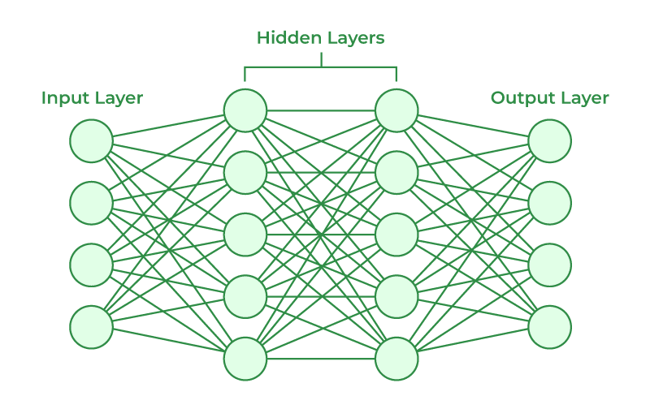

# Artifical Neural Network (ANN)
ANN are neuraly mathematical models which contains artifical neurons called units. Units are arranged in series of layers together that constitute the whole ANN in a system.

ANN has an input layer, hidden layer and output layer. 
    i/p layer = accepts data from outside world
    hidden layer = data passes through one or multiple hidden layers that transforms input into meaningful output
    o/p layer = get the data from output layer and pass the meaningful output. here final decision or prediction is made.

## ANN vs Biological Neuron

    ANN:
    1. Compnents : i/p layer, hidden layer, output layer
    2. functions : take weighted i/p, apply activation function and produce ouput
    3. learning process : weights are optimized used optimization techniques like gradient descent
    4. processing speed: Fast nanoseconds per computation

    Biological Neuron:
    1. components: Dendrites, Axioms, Synapes
    2. functions: transmitts and process electrical impulses
    3. learning process: neuron connectivity changes over time
    4. processing speed: slow (milliseconds per computation)