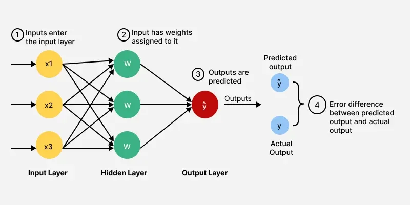
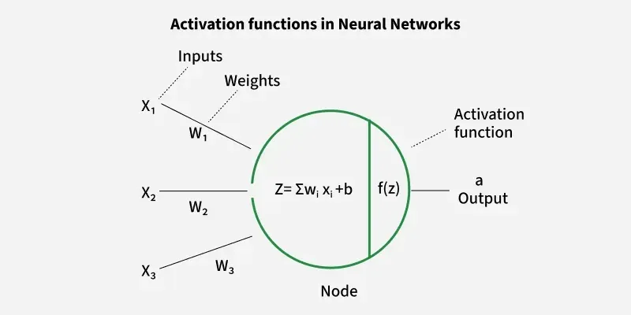

# Feed Forward Neural Network (FNN)
FNN is a type of neural network in which information flows in a single direction from input to ouput without any feedback loop or cycles.
It is a foundational architecture used in machine learning tools like classification and regression

### characteristics of FNN
1. unidirectional information flow: information/data flows from input layer to hidden layer to the output layer
2. No feedback loop: Unlike RNN, FNN dont have conenctions that loop back
3. supervised Learning: FNN are commonly used for supervised learning tasks.

### Strucutre 

Feedward neural network has a structured layered desing where data flows sequentially thorugh each layer.
1. input layer: input layer consists of neuron that recieves input data. Each neuron in the input layer represent a feature of the input data
2. Hidden layer: One or more hidden layer are present between input layer and output layer. Hidden layer are responsible for finding complex patterns in the data.
3. Output layer: this layer is responsible for providing the final output of the network.
The number of neurons in this layer corresponds to the number of classes in classification problems or number of outputs in regression problems.

Each connections between the neurons has associated weights between them which is adjusted during training process to minimize errors in the predictions.

### Activation Function
Activation function introduce non linearity into the network allowing the networks to learn complex data patterns.

Common activation functions are:
1. Sigmoid: 1/(1+e^-x)
2. Tanh: (e^x - e^-x )/(e^x+e^-x)
3. Relu: max(0,x)

