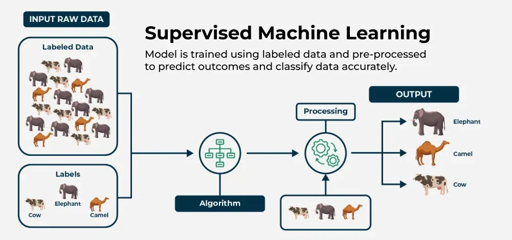
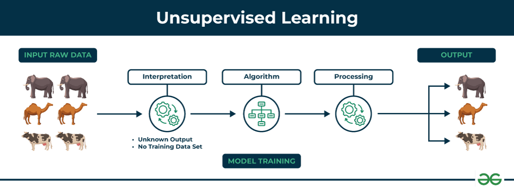

# Machine Learning Defination:
Machine learning is a process of training a piece of software called model to make useful prediction and generating contents like image,text,voice, videos etc from data. Here, the model means the mathematical relationship derived from data that an ML system use to make predictions.

for example: if we have to predict weather forcasting we could use either traditional approach or the machine learning approach. 
In traditional approach, we have to sit and use study about atmosphere and complex mathematical equations, we have to use physics based representation which is very hard and very difficult. On other hand we have Machine Learning approach where we train an model with enormous amount of data until ML model eventually learn the mathematical relationship between weather patterns that can produce differing weather patterns. It would automatically predict the weather for the coming days based on the today weather pattern.

## Types of Machine Learning
Machine learning system can fall under one or more of the following category according to they way they make predections or generate content:
1. Supervised Learning
2. Unsupervised Learning
3. Reinforcement Learning
4. Generative AI
5. Active learning

## Supervised Learning
Supervised learning is a process of training a model with a large set of datas with correct answers and then model itself make connections between elements in the data to produce the correct answer. It is like student preparing for upcoming exams by learning from multiples old question bank with both question and correct answers. After learning from multiple question sets they are ready for the next exams. 

There are two types of supervised learning: Regression and classification
i. Regression: Regression are used to make prediction and give answers in numeric value. For example model calculating the amount of rainfall based on different known parameters like humidity, atmosphere etc is a regression model. 
 Further See the table below to see more examples of Regression: 

| Scenario            | Possible Input Data                                                                 | Output                |
|---------------------|--------------------------------------------------------------------------------------|------------------------|
| Future House Price  | Square foot, number of bedrooms, location, construction costs, property tax, mortgage tax | The price of a home   |

 ii. Classification: Classification predicts the likelihood that something belongs to a category or not. Unlike regression model whose output is a numeric value, classification gives output either 0 (false) or 1 (True). For example classification helps to classify whether a mail is spam or not. 
 There are also two typess of classification : Binary Classification, Multiclass classification. Lets Understand it as: There is a model which predicts rainfall based on the given inputs. With binary classification the model predicts either it rains or no rain. Basically a yes or no statement. But with Multi class classification model can predicts either rain, hail or snow basically multiple possibilities.

 ## Unsupervised Learning
 Unsupervised learning is a branch of machine learning that deals with unlabeled data. Unsupervised Learning help model predict by giving datas that doesnt contain correct answers. It make predicitions by making patterns among the datas. The famous method for unsupervised learning is Clustering. 

This image shows sets of animals: elephant, camel and cow as raw input data that unsupervised learning algorithm will process. 
 **.** Interpretation stage signifies that algorithm doesnt have predefined label or data. It needs to find patterns among the data itself to group them
 **.** Algorithm stage is the core of unsupervised learning process using techniques like clustering, anamoly detection to identify patterns and structure in the data.
 **.** Processing stage shows how algorithm process the data.

 ## Reinforcement Learning
 Reinforcement learning is a process where a model learn by making decisions by interacting with environments and trying to maximize rewards over time. It makes predictions by getting reward or penalties based on the actions performed with in an environment. A reinforcement learning generates a policy that defines best strategy for getting most rewards. 

 Reinforcement learning is used to make robots to perform tasks like walking the room and perform some tasks where they learn continuously and improve their accuracy.

 ## Generative AI
 Generative AI is a class of models that help to generate content based on user inputs. On high level generative AI works studying the patterns in the data and model try to mimic the data it trained on. 
 The classy example of GENAI is that comedian trying to intimate people based on their behaviour.

 ## Active Learning
 Active learning is a training approach where model actively selects the data it learns from. Instead of learning from fixed dataset, model chooses the most informative samples to be labeled which helps it to learn more efficiently.
 Suppose you have 10000 unlabeled images, but you can only afford to label 500. With active learning you might:
  . start with random 50 random labeled images
  . Train an initial model
  . use the model to query 50 new images it most uncertain about.
  . Repeat the cycle until you have labeled all 500.

 ## from internet
 supervised learning, in which the data comes with additional attributes that we want to predict (Click here to go to the scikit-learn supervised learning page).This problem can be either:

    classification: samples belong to two or more classes and we want to learn from already labeled data how to predict the class of unlabeled data. An example of a classification problem would be handwritten digit recognition, in which the aim is to assign each input vector to one of a finite number of discrete categories. Another way to think of classification is as a discrete (as opposed to continuous) form of supervised learning where one has a limited number of categories and for each of the n samples provided, one is to try to label them with the correct category or class.

    regression: if the desired output consists of one or more continuous variables, then the task is called regression. An example of a regression problem would be the prediction of the length of a salmon as a function of its age and weight.

 unsupervised learning, in which the training data consists of a set of input vectors x without any corresponding target values. The goal in such problems may be to discover groups of similar examples within the data, where it is called clustering, or to determine the distribution of data within the input space, known as density estimation, or to project the data from a high-dimensional space down to two or three dimensions for the purpose of visualization (Click here to go to the Scikit-Learn unsupervised learning page).