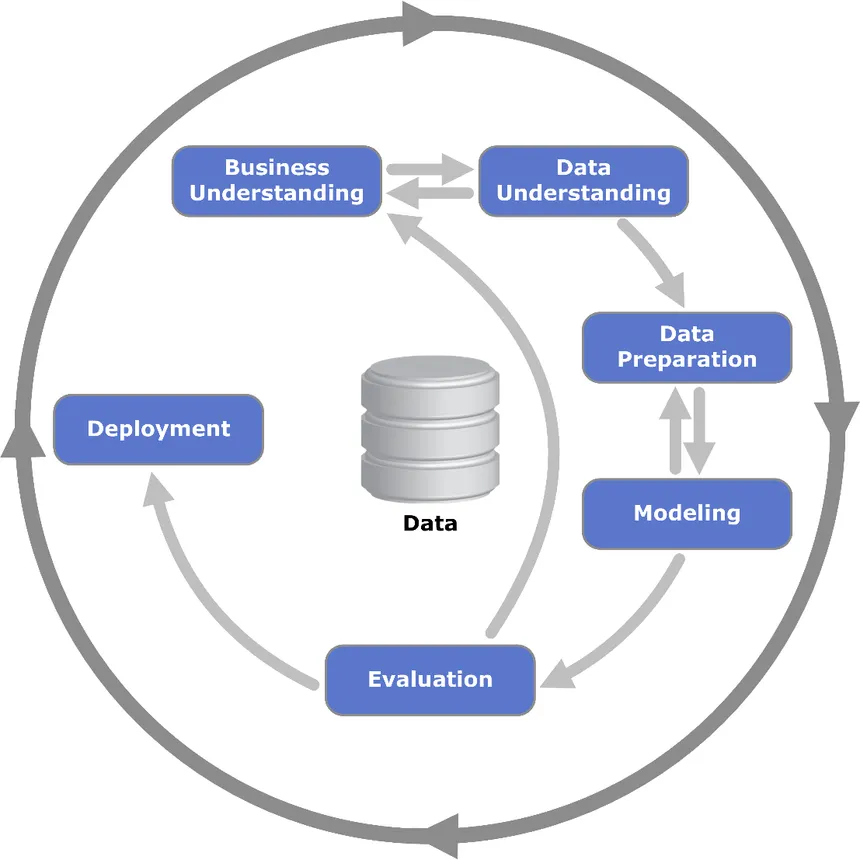

## Machine Learning Workflow

Here we will understand about CRISP-DM (Cross industry Standard Process for Data Mining). It is a step by step framework for machine learning and data science projects.

# Steps in CRISP-DM
1. Business Understanding
2. Data Understanding
3. Data Preprocessing
4. Model selection
5. Model Evalutaion
6. Deployment

Lets Understand each step briefly:
1. Business Understanding: It refers to what problem we are solving. It defines our project objectives and understanding how this solution benefit the business. The key question asked in this step is "Why this matters?"

2. Data Understanding: It basically tells us if the data we have are useful or not. It tells what we have and how can we use it. It includes exploring data with visualization and statistics. In this step we spot patterns and missing values and errors in the data. Basically it says if the data is useful or not?

3. Data preparation: It involves structuring and cleaning data for modeling. It includes fixing errors, missing values. It helps to split data into training and test sets. 
Key question asked: Is the data ready for the model?

4. Modeling: It means building and training model with our data. For this we choose an algorithm, then train the model with that algorithm on prepared data and tune the model for better performance.

5. Evalutaion: It means analyzing whether or not our model solve the problem or not. In this step we see if the obtained result alined with the business objectives or not. In this step we check of overfitting and biasness.

6. Deployment: It means putting the model for the real world application. It includes integrating into apps, dashboards, or workflows.